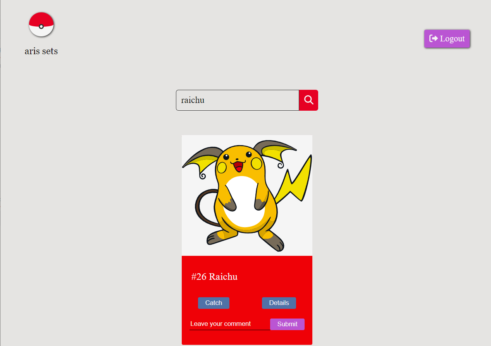

# Pokedex

## Description

&nbsp;&nbsp;&nbsp;&nbsp;An app where you can find the information about any pokemon!

## Main Stack

- React
- Vanilla JavaScript
- Node.js
- Express.js
- MySQL

## Features

- You can sign up and login as a user with username and password.
- You can search any pokemon through search bar.
- When you can click on the details button, it appears a modal with its characteristics.
- You can click on pokemon's evolutions and check their  characteristics.
- When you click the catch button, you can add this pokemon to your sets of six.
- You can leave a comment on a pokemon.
- You can see all the comments in the details modal.
- On the upper left corner, you can click the pokeball to see all your sets.
- You can remove a pokemon from your sets.